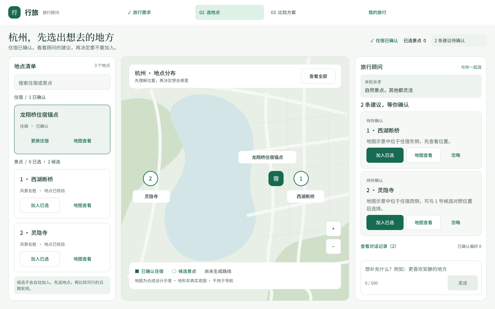
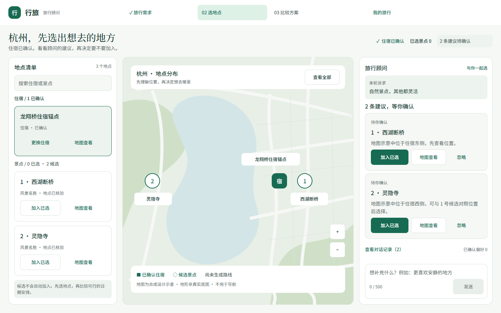

# F-019 视觉基准与最终运行图

冻结版本 F019-UI3-v1。参考图SHA-256：0716C820133AF764D1FB8197CCCBB63161C5EB59862613AE4E0B0C6037192E65。原冻结包12项于最终收口时重新核验，未覆盖或采用在线Figma漂移。

目标为默认App/F009Planner的selection旅程：杭州与住宿已确认，2条pending景点建议，0已选景点、0偏好，草稿为空、发送禁用。顶栏72、上下文92、工作区712、外边距24、三栏312/664/384、间距16。标记可独立交互，地图仅合成示意，编号不是路线顺序。

正文Noto Sans SC、标题Noto Serif SC使用现有本机字体并验证实际glyph；无字体复制或分发。最终正常态与UI8及获批UI7运行图像素差为0，与最早UI6运行图仍保留此前已记录的1像素差。

UI6正常态、UI7新增页面/断点已有用户明确批准；本次最终确认依据用户授权，由Agent重新核对截图及证据，不声称用户再次亲自查看了修复后的图。[确认记录](../../delivery/f019-confirmation.json)。视觉确认不等同真实Provider或真实地图验收。
